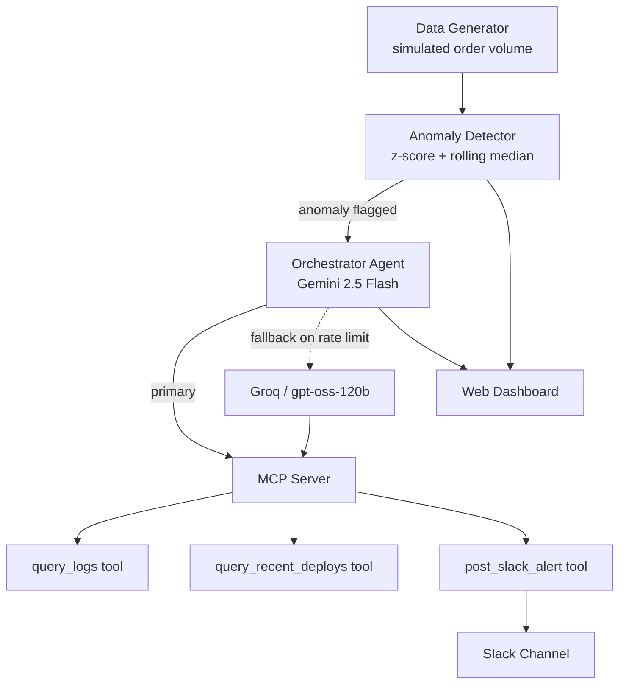

# Data Pipeline Anomaly-Triage Agent

An agentic AI system that monitors a data pipeline, detects anomalies, and automatically investigates root causes using an LLM agent with MCP (Model Context Protocol) tools — deployed to production on Google Cloud Run with full CI/CD.

**Live demo:** https://anomaly-agent-513866903957.us-central1.run.app/
---

## What it does

1. Simulates hourly e-commerce order volume data
2. Runs statistical anomaly detection (z-score + rolling-median drop detection) to flag unusual behavior
3. Hands each flagged anomaly to an LLM agent, which investigates using real MCP tools — querying logs, checking recent deploys — before producing a root-cause diagnosis and severity rating
4. Posts the diagnosis to Slack
5. Falls back to a secondary LLM provider (Groq) if the primary model (Gemini) is rate-limited or unavailable

All of this is exposed through a small web dashboard and a REST API, containerized, and deployed to Cloud Run — with every push to `main` automatically rebuilding and redeploying via GitHub Actions.

## Why this project

Most anomaly-detection demos stop at "here's a chart with an outlier circled." The interesting (and useful) part of an incident is *why it happened* and *what to do about it* — the part a human on-call engineer spends the most time on. This project automates that investigation step: rather than just flagging an anomaly, the agent decides what evidence it needs, gathers it through tools, and reasons to a diagnosis — the same workflow a human would follow, but immediate and consistent.

## Architecture



**Components:**
- **Data generator** — produces synthetic hourly order-volume data with deliberately injected, labeled anomalies (a volume drop and a traffic spike), giving the project ground-truth data for evaluation
- **Anomaly detector** — z-score thresholding plus rolling-median drop detection (median chosen over mean specifically to avoid outlier contamination of the baseline — see [Design Decisions](#design-decisions))
- **Orchestrator agent** — an LLM agent (Gemini 2.5 Flash, with automatic retry and a Groq-based fallback) that decides which tools to call and in what order
- **MCP server** — exposes `query_logs`, `query_recent_deploys`, and `post_slack_alert` as standardized tools over the Model Context Protocol, running as a separate process from the agent
- **Web dashboard** — a lightweight UI (FastAPI + vanilla JS) so the pipeline can be triggered and inspected without hitting the API directly
- **Evaluation suite** — a set of labeled test cases run against the agent to measure diagnostic accuracy

## Tech stack

| Layer | Tool |
|---|---|
| LLM (primary) | Google Gemini 2.5 Flash |
| LLM (fallback) | Groq (gpt-oss-120b) |
| Tool protocol | Model Context Protocol (MCP) |
| API / web server | FastAPI + Uvicorn |
| Data | pandas, numpy |
| Notifications | Slack Incoming Webhooks |
| Containerization | Docker |
| Deployment | Google Cloud Run |
| CI/CD | GitHub Actions |

## Evaluation

The agent's diagnoses are checked against a labeled set of anomaly scenarios with known root causes, using a keyword-match scoring heuristic (see `eval_cases.py` and `run_eval.py`). This is deliberately simple and explainable rather than a black-box score — the tradeoffs of keyword matching vs. LLM-graded scoring are discussed in the eval script's comments.

```bash
python3 run_eval.py
```

## Design decisions

A few real debugging moments worth calling out, since they reflect actual engineering judgment rather than a clean-room tutorial build:

- **Rolling mean → rolling median.** The initial drop-detection baseline used a rolling mean, which caused false positives for several hours *after* a spike (the spike inflated the mean of its own trailing window). Switched to a rolling median, which is far more robust to single-point outliers.
- **Static mock tool data → context-aware mock data.** Early on, `query_logs` returned the same canned log output regardless of the anomaly being investigated, causing the agent to attribute unrelated anomalies to the same root cause. Fixed by making the tool's response vary by context.
- **Eager fallback-client initialization.** The Groq fallback client was originally initialized at module import time. A missing `GROQ_API_KEY` in one environment caused the *entire application* to crash on startup — including the primary Gemini path, which didn't need Groq at all. Fixed with lazy initialization and a graceful "fallback unavailable" path instead of a hard crash.
- **ARM64 vs. AMD64 Docker builds.** Images built on Apple Silicon defaulted to ARM64, which Cloud Run rejects. Builds now explicitly target `linux/amd64`.

## Running locally

```bash
git clone https://github.com/Shreevarthini/anomaly-triage-agent.git
cd anomaly-triage-agent
python3 -m venv venv && source venv/bin/activate
pip install -r requirements.txt

# create a .env file with:
# GEMINI_API_KEY=...
# GROQ_API_KEY=...
# SLACK_WEBHOOK_URL=...

uvicorn main:app --reload --port 8080
```
Visit `http://localhost:8080` and click **Run Pipeline Check**.

## Deployment

Deployed on Google Cloud Run (`us-central1`), built via Docker, with GitHub Actions handling build → push → deploy on every push to `main`. See `.github/workflows/deploy.yml`.

```bash
docker build --platform linux/amd64 -t anomaly-agent .
gcloud run deploy anomaly-agent --image <image-path> --region us-central1 --allow-unauthenticated
```

## Project structure

```
.
├── main.py                  # FastAPI app: dashboard + API endpoints
├── agent_mcp.py              # Orchestrator agent (Gemini + Groq fallback, MCP client)
├── mcp_server.py              # MCP server exposing logs/deploys/Slack tools
├── anomaly_detector.py        # Z-score + rolling-median detection
├── generate_data.py           # Synthetic data generator with injected anomalies
├── eval_cases.py               # Labeled evaluation scenarios
├── run_eval.py                 # Evaluation runner + scoring
├── static/index.html           # Web dashboard
├── Dockerfile
└── .github/workflows/deploy.yml  # CI/CD pipeline
```

## What's next

- Swap in a real (unlabeled) e-commerce dataset alongside the synthetic labeled set
- LLM-graded evaluation scoring, as an upgrade over keyword matching
- A second, specialist agent for severity-based alert routing/escalation